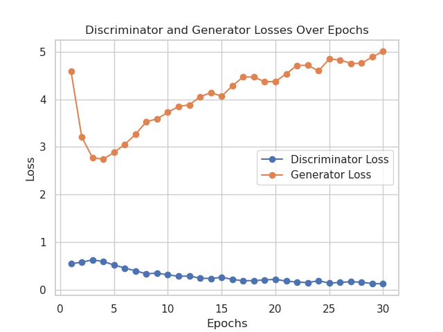
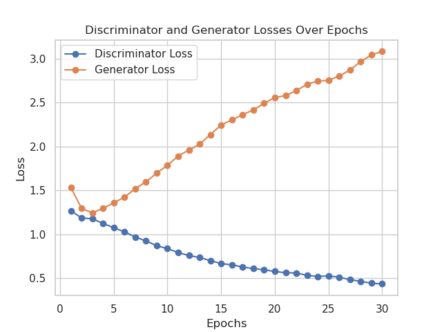
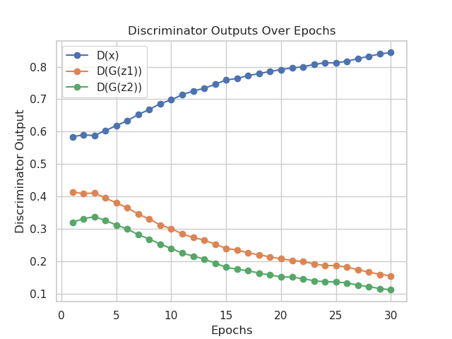

# Setup

This repository contains a script for training Generative Adversarial Networks (GANs) on the CelebA dataset using PyTorch. The script allows flexibility in choosing different network architectures, configuring hyperparameters, and saving training progress. Currently, is is possible
of training three GANs models: DCGAN, DCGAN with spectral normalization, and DCGAN with self-attention. Those models are inspired on the following paper [paper 1](https://arxiv.org/abs/1511.06434), [paper 2](https://arxiv.org/abs/1802.05957), [paper 3](https://arxiv.org/abs/1805.08318).

## Prerequisites

Before running the script, ensure you have the following installed:

- Python 3.x
- Conda (recommended)
- Other dependencies specified in the `environment.yml` 

### 1. Create Conda Environment

First, download this repo and create a Conda environment using the provided `environment.yml` file.

```
git clone https://github.com/mateuszgabor/gans.git && cd gans 
conda env create --prefix ./myenv -f environment.yml
conda activate myenv/

```

### 2. Create directory for CelebA dataset and donwload it

TThe script automatically downloads the CelebA dataset. However, in some cases it does not work. If that happen. create `celeba` folder manually (`mkdir celeba`) and download the following files directly to this folder.
- [File 1](https://drive.google.com/uc?id=0B7EVK8r0v71pZjFTYXZWM3FlRnM)
- [File 2](https://drive.google.com/uc?id=0B7EVK8r0v71pblRyaVFSWGxPY0U)
- [File 3](https://drive.google.com/uc?id=1_ee_0u7vcNLOfNLegJRHmolfH5ICW-XS)
- [File 4](https://drive.google.com/uc?id=0B7EVK8r0v71pbThiMVRxWXZ4dU0)
- [File 5](https://drive.google.com/uc?id=0B7EVK8r0v71pd0FJY3Blby1HUTQ)
- [File 6](https://drive.google.com/uc?id=0B7EVK8r0v71pY0NSMzRuSXJEVkk)


### 3. Train GANs
The training script is `main.py`. The script accepts several command-line arguments to configure the training process. Below are the available options.

```
python main.py [-net NET] [-lr LR] [-epochs EPOCHS] [-bs BS] [-b_1 B_1] [-b_2 B_2] [-nc NC] [-nf NF] [-nz NZ] [-workers WORKERS]
```
#### Arguments:
- `-net`: The name of the GAN network architecture to use. Available options: `dcgan`, `spectral_dcgan`, `sagan`. (default: `dcgan`).
- `-lr`: Learning rate for the optimizers (default: `2e-4`).
- `-epochs`: Number of training epochs (default: `30`).
- `-bs`: Batch size for the DataLoader (default: `64`).
- `-b_1`: Beta1 hyperparameter for the Adam optimizer (default: `0.5`).
- `-b_2`: Beta2 hyperparameter for the Adam optimizer (default: `0.999`).
- `-nc`: Number of channels in the input image (default: `3`).
- `-nf`: Number of features in the network (default: `64`).
- `-nz`: Size of the latent vector (default: `100`).
- `-workers`: Number of worker threads for loading data (default: `4`).

All models were trained with default parameters. To train standard DCGAN use the following command:
```
python train_gan.py -net dcgan
```

To train DCGAN with spectral normalization on discriminator use the following command:
```
python train_gan.py -net spectral_dcgan
```

To train DCGAN with self-attention use the following command:
```
python train_gan.py -net sagan
```

The script will create the following directories:

- `checkpoints/{NET}`: Stores the model checkpoints.
- `generated/{NET}`: Stores the generated images after each epoch.
- `train_details`: Stores the training logs including losses and other metrics.

### 4. Creating GIFs
Script `create_gif.py` generates a GIF from a sequence of PNG images generated by trained GANs. The GIF includes titles indicating the epoch for each frame, displayed above the image.

The script can be run from the command line with various options as follows.
```
python create_gif.py [-path PATH] [-d D] [-l L] [-fs FS]
```

#### Arguments:
- `-path`: The path to the folder containing the PNG images generated by GANs.
- `-d`: The duration between frames in milliseconds (default: `500`).
- `l`: The number of times the GIF should loop (default: `0` - infinite loop).
- `fs`: The font size for the epoch title text (default: `36`).

The script will create new directory `gifs` (if not exists), where the created GIFs will be stored.

#### Examples of usage
1. Creating GIF for DCGAN
```
python create_gif.py -path generated/dcgan
```
2. Creating GIF for DCGAN with spectral normalziation
```
python create_gif.py -path generated/spectral_dcgan
```
3. Creating GIF for DCGAN with self-attention
```
python create_gif.py -path generated/sagan
```


### 5. Creating plots
Script `create_plots.py` generates plots from the the training results results saved in `train_details` directory. It visualizes the discriminator and generator losses over epochs, as well as the outputs of the discriminator during training.

The script can be run from the command line with various options as follows.
```
python create_plots.py [-path PATH]
```
#### Arguments:
- `-path`: The path to the file containing the training details saved during GAN training. This file is expected to be a PyTorch saved dictionary (.pth file).
- 
#### Examples of usage
1. Creating plots for DCGAN
```
python create_plots.py -path train_details/dcgan.pth
```
2. Creating plots for DCGAN with spectral normalziation
```
python create_plots.py -path train_details/spectral_dcgan.pth
```
3. Creating plots for DCGAN with self-attention
```
python create_plots.py -path train_details/sagan.pth
```

### 6. Results for DCGAN
#### Generated images


#### Discriminator and generator losses


#### Discriminator outputs


### 7. Results for DCGAN with spectral normalization
#### Generated images


#### Discriminator and generator losses


#### Discriminator outputs


### 8. Results for DCGAN with self-attention
#### Generated images


#### Discriminator and generator losses


#### Discriminator outputs



